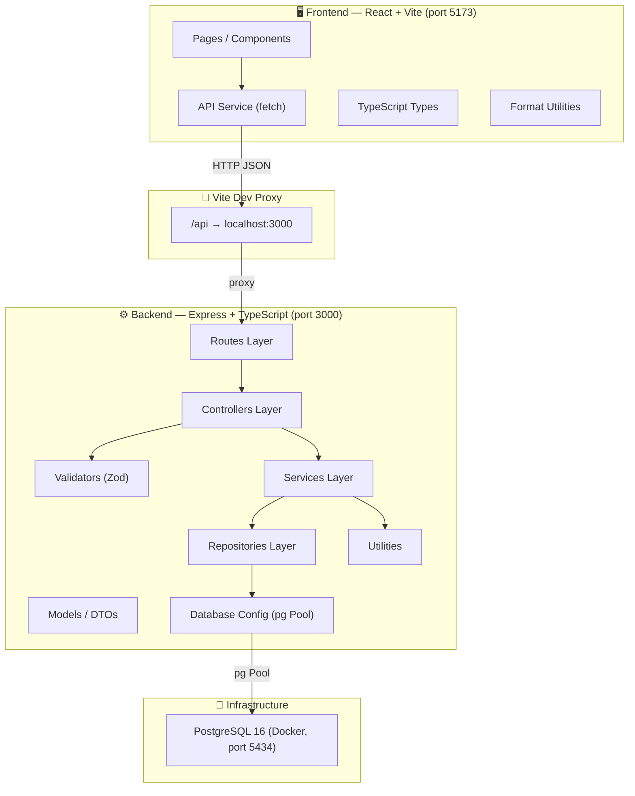
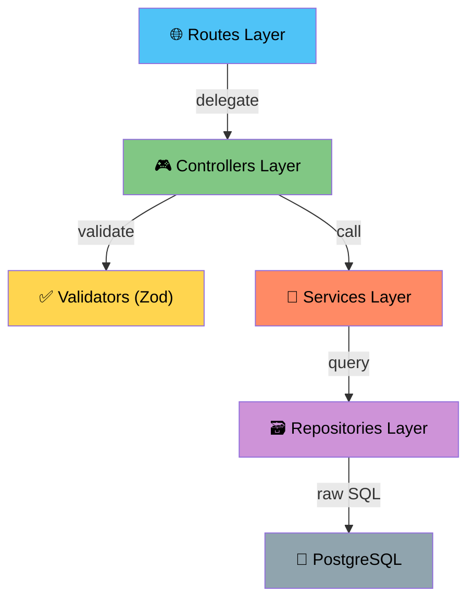
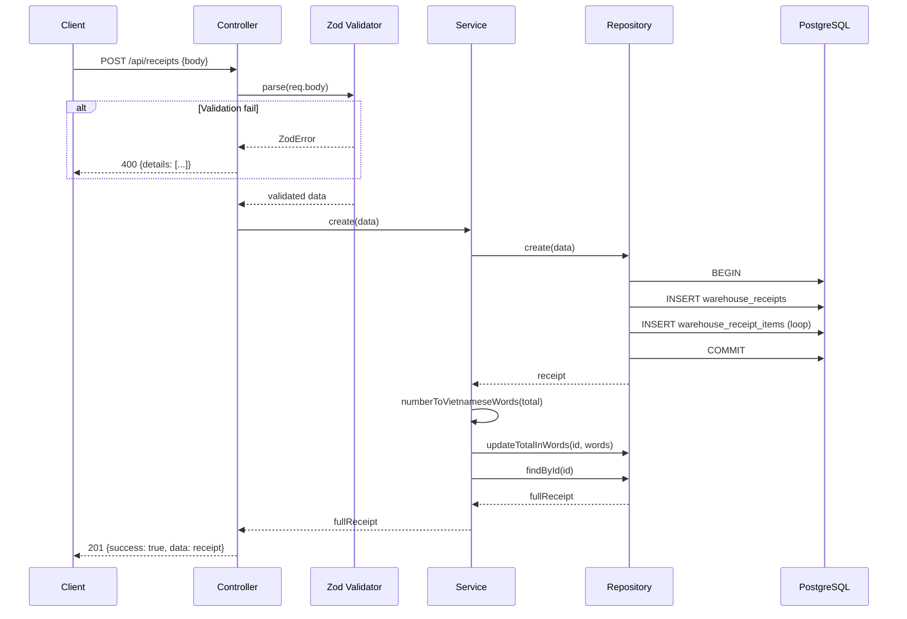
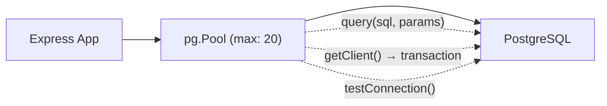
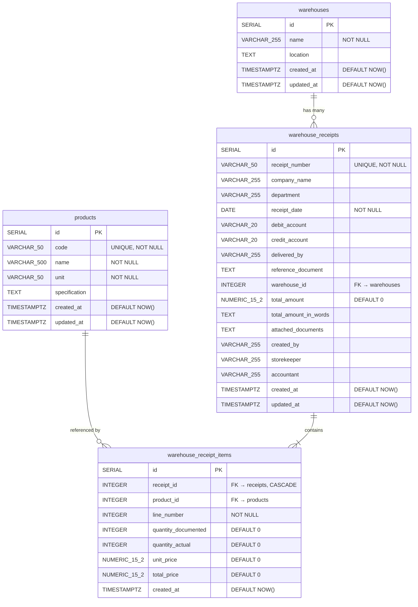
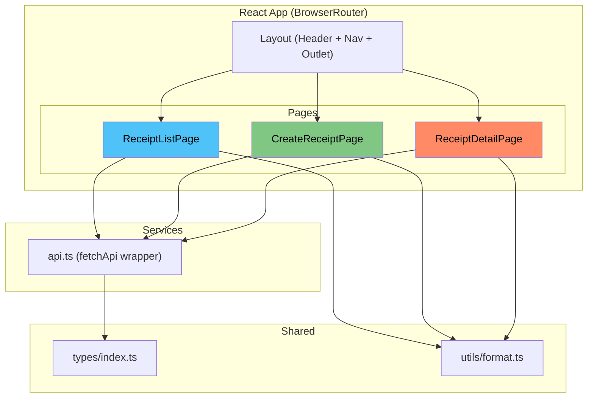
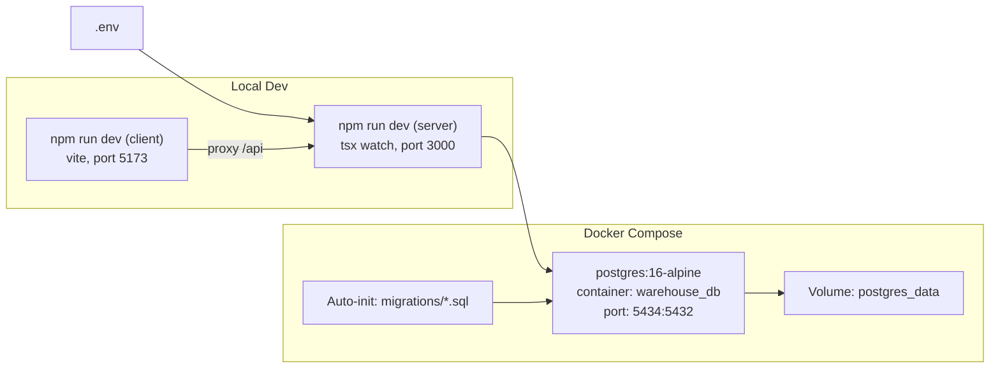
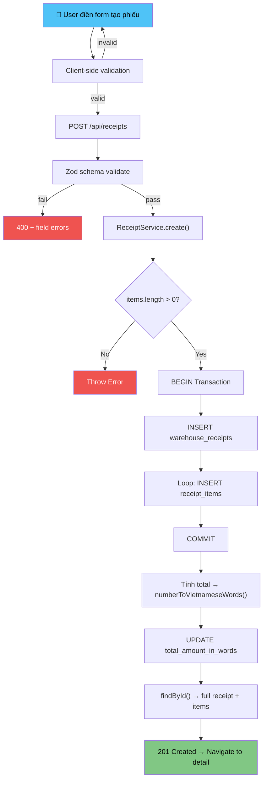
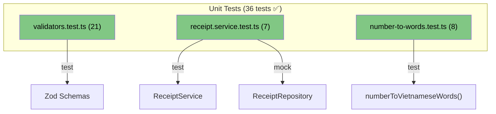

# 🏗️ Kiến Trúc Hệ Thống — Warehouse Receipt Management

## 1. Tổng quan hệ thống

Hệ thống quản lý Phiếu Nhập Kho theo **Mẫu 01-VT** (TT 200/2014/TT-BTC), áp dụng kiến trúc **Client-Server** với 3 tầng rõ ràng.



---

## 2. Kiến trúc phân tầng Backend (Layered Architecture)

Backend tuân theo mô hình **4 lớp**, mỗi lớp chỉ phụ thuộc lớp bên dưới:



### 2.1 Routes Layer — Định tuyến HTTP

> **Nhiệm vụ:** Map HTTP method + URL path → Controller method. Không chứa logic.

| File | Prefix | Endpoints |
|------|--------|-----------|
| `receipt.routes.ts` | `/api/receipts` | GET `/`, GET `/:id`, POST `/`, DELETE `/:id`, GET `/stats` |
| `product.routes.ts` | `/api/products` | GET `/`, POST `/` |
| `warehouse.routes.ts` | `/api/warehouses` | GET `/`, POST `/` |

---

### 2.2 Controllers Layer — Xử lý Request/Response

> **Nhiệm vụ:** Parse request, gọi validator, gọi service, format response. Xử lý error codes (400, 404, 409, 500).

| File | Chức năng chính |
|------|----------------|
| `receipt.controller.ts` | CRUD phiếu nhập kho, xử lý lỗi duplicate/FK violation |
| `product.controller.ts` | CRUD sản phẩm |
| `warehouse.controller.ts` | CRUD kho |

**Luồng xử lý tạo phiếu:**


---

### 2.3 Validators Layer — Kiểm tra dữ liệu (Zod)

> **Nhiệm vụ:** Schema validation với thông báo lỗi tiếng Việt.

File: `schemas.ts`

| Schema | Quy tắc chính |
|--------|---------------|
| `createReceiptSchema` | `receipt_number` required, max 50 ký tự; `receipt_date` format YYYY-MM-DD; `items` ≥ 1 phần tử |
| `receiptItemSchema` | `product_id` int > 0; `quantity_*` int ≥ 0; `unit_price` ≥ 0 |
| `createProductSchema` | `code` unique, max 50; `name` required, max 500; `unit` required |
| `createWarehouseSchema` | `name` required, max 255 |

---

### 2.4 Services Layer — Business Logic

> **Nhiệm vụ:** Chứa logic nghiệp vụ. Hỗ trợ **Dependency Injection** qua constructor.

| File | Logic chính |
|------|------------|
| `receipt.service.ts` | Validate items ≥ 1, tính tổng, chuyển số → chữ VN, gọi repo |
| `product.service.ts` | Delegate CRUD |
| `warehouse.service.ts` | Delegate CRUD |

**Dependency Injection pattern:**
```typescript
export class ReceiptService {
  // Inject repo qua constructor → dễ mock khi test
  constructor(private readonly repo: ReceiptRepository = receiptRepository) {}
}
```

**Utility:** `number-to-words.ts` — Chuyển số → chữ tiếng Việt (`1500000` → `"Một triệu năm trăm nghìn đồng"`)

---

### 2.5 Repositories Layer — Data Access (Raw SQL)

> **Nhiệm vụ:** Tương tác trực tiếp với PostgreSQL qua raw SQL (không ORM). Sử dụng **transaction** cho tính toàn vẹn.

| File | Queries chính |
|------|--------------|
| `receipt.repository.ts` | `findAll` (JOIN warehouses), `findById` (JOIN products), `create` (TRANSACTION), `delete` |
| `product.repository.ts` | CRUD products |
| `warehouse.repository.ts` | CRUD warehouses |

**Transaction pattern cho tạo phiếu:**
```typescript
const client = await getClient();
try {
  await client.query("BEGIN");
  // 1. INSERT receipt header → get receipt.id
  // 2. Loop INSERT receipt items (dùng receipt.id)
  await client.query("COMMIT");
} catch (error) {
  await client.query("ROLLBACK");
  throw error;
} finally {
  client.release();
}
```

---

### 2.6 Database Config — Connection Pool

File: `database.ts`



| Config | Giá trị |
|--------|---------|
| Pool size | max 20 connections |
| Idle timeout | 30s |
| Connection timeout | 5s |
| Dev logging | Query text + duration + row count |

---

## 3. Thiết kế Database (ERD)



### Indexes & Constraints

| Index/Constraint | Bảng | Mục đích |
|---------|------|----------|
| `UNIQUE(receipt_number)` | `warehouse_receipts` | Không trùng số phiếu |
| `UNIQUE(code)` | `products` | Không trùng mã sản phẩm |
| `UNIQUE(receipt_id, line_number)` | `warehouse_receipt_items` | Không trùng STT trong 1 phiếu |
| `FK warehouse_id → warehouses(id)` | `warehouse_receipts` | Tham chiếu kho |
| `FK receipt_id → receipts(id) CASCADE` | `warehouse_receipt_items` | Xóa phiếu → xóa items |
| `FK product_id → products(id)` | `warehouse_receipt_items` | Tham chiếu sản phẩm |
| `idx_receipt_items_receipt` | `warehouse_receipt_items` | Tăng tốc query items theo receipt |
| `idx_receipts_warehouse` | `warehouse_receipts` | Tăng tốc filter theo kho |
| `idx_receipts_date` | `warehouse_receipts` | Tăng tốc sort/filter theo ngày |
| `idx_products_code` | `products` | Tăng tốc lookup theo mã SP |

### Mapping Mẫu 01-VT → Database

| Vùng trên form | Bảng | Cột |
|:------|:------|:------|
| Đơn vị / Bộ phận | `warehouse_receipts` | `company_name`, `department` |
| Ngày...tháng...năm / Số | `warehouse_receipts` | `receipt_date`, `receipt_number` |
| Nợ / Có | `warehouse_receipts` | `debit_account`, `credit_account` |
| Người giao | `warehouse_receipts` | `delivered_by` |
| Theo chứng từ... | `warehouse_receipts` | `reference_document` |
| Nhập tại kho...địa điểm | `warehouses` | `name`, `location` (qua FK) |
| Bảng chi tiết (cột A-D, 1-4) | `warehouse_receipt_items` + `products` | `line_number`, product info, quantities, prices |
| CỘNG | `warehouse_receipts` | `total_amount` (auto-calc) |
| Tổng số tiền (viết bằng chữ) | `warehouse_receipts` | `total_amount_in_words` (auto-gen) |
| Số chứng từ gốc kèm theo | `warehouse_receipts` | `attached_documents` |
| 4 ô chữ ký | `warehouse_receipts` | `created_by`, `delivered_by`, `storekeeper`, `accountant` |

---

## 4. Kiến trúc Frontend



### Routing

| Path | Component | Chức năng |
|------|-----------|----------|
| `/` | `ReceiptListPage` | Danh sách phiếu, xóa phiếu |
| `/create` | `CreateReceiptPage` | Form tạo phiếu mới |
| `/receipts/:id` | `ReceiptDetailPage` | Xem chi tiết + chữ ký |

### API Service — Proxy Pattern

```
Client (port 5173) → Vite Proxy (/api → localhost:3000) → Express Server
```

File `api.ts` — Generic `fetchApi<T>()` wrapper xử lý:
- Set `Content-Type: application/json`
- Parse response envelope `{success, data, error, details}`
- Throw Error nếu `success: false` (kèm field-level messages)

---

## 5. Infrastructure & DevOps



| Script | Mục đích |
|--------|----------|
| `docker compose up -d` | Khởi tạo PostgreSQL container |
| `npm run migrate` | Chạy SQL migrations (tạo bảng) |
| `npm run seed` | Insert dữ liệu mẫu (3 kho, 10 sản phẩm) |
| `npm run dev` (server) | Dev server với hot-reload (`tsx watch`) |
| `npm run dev` (client) | Vite dev server + API proxy |
| `npm test` | Chạy 36 unit tests (Jest) |

---

## 6. Luồng dữ liệu chính — Tạo Phiếu Nhập Kho



---

## 7. Cấu trúc thư mục

```
📦 Warehouse Receipt Management
├── 🐳 docker-compose.yml          ← PostgreSQL container
├── 🔑 .env                        ← DB credentials + server config
├── 📦 package.json                ← Root monorepo scripts
│
├── ⚙️ server/                     ← BACKEND
│   ├── src/
│   │   ├── app.ts                 ← Express entry point, middleware, error handler
│   │   ├── config/
│   │   │   └── database.ts        ← pg Pool config, query helper, testConnection
│   │   ├── models/                ← TypeScript interfaces (Entity + DTO)
│   │   │   ├── receipt.model.ts   ← WarehouseReceipt, ReceiptItem, CreateReceiptDto
│   │   │   ├── product.model.ts   ← Product, CreateProductDto
│   │   │   └── warehouse.model.ts ← Warehouse, CreateWarehouseDto
│   │   ├── validators/
│   │   │   └── schemas.ts         ← Zod schemas (receipt, product, warehouse)
│   │   ├── routes/                ← HTTP routing (method + path → controller)
│   │   ├── controllers/           ← Request parsing, response formatting, error codes
│   │   ├── services/              ← Business logic, DI via constructor
│   │   ├── repositories/          ← Raw SQL queries, transactions
│   │   ├── utils/
│   │   │   └── number-to-words.ts ← Số → chữ tiếng Việt
│   │   └── migrations/
│   │       ├── 001_init.sql       ← CREATE TABLE statements
│   │       ├── run.ts             ← Migration runner
│   │       └── seed.ts            ← Sample data (3 kho, 10 sản phẩm)
│   └── tests/unit/                ← Jest unit tests (36 tests)
│       ├── receipt.service.test.ts
│       ├── validators.test.ts
│       └── number-to-words.test.ts
│
└── 🖥️ client/                     ← FRONTEND
    ├── vite.config.ts              ← Vite + React plugin + API proxy
    └── src/
        ├── App.tsx                 ← BrowserRouter + Routes
        ├── components/
        │   └── Layout.tsx          ← Header + Nav + Outlet
        ├── pages/
        │   ├── ReceiptListPage.tsx  ← Danh sách phiếu (GET, DELETE)
        │   ├── CreateReceiptPage.tsx← Form tạo phiếu (POST)
        │   └── ReceiptDetailPage.tsx← Chi tiết + chữ ký (GET)
        ├── services/
        │   └── api.ts              ← Generic fetchApi<T> wrapper
        ├── types/
        │   └── index.ts            ← Client-side TypeScript interfaces
        └── utils/
            └── format.ts           ← formatCurrency, formatNumber, formatDate
```

---

## 8. Testing Strategy



- **Mock pattern:** Service tests dùng `jest.Mocked<ReceiptRepository>` — không cần DB thật
- **Coverage:** Validation rules, business logic, utility functions, error paths
